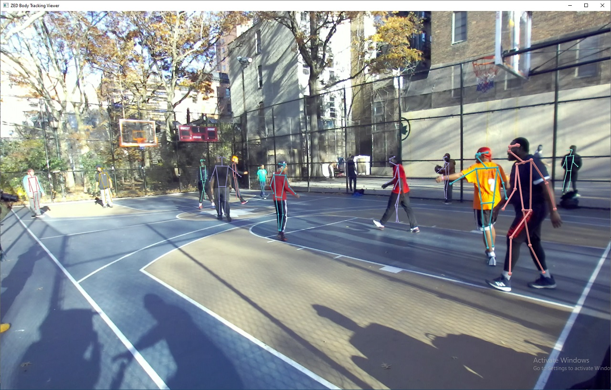

# ZED SDK - Body Tracking

## This sample shows how to detect and track human bodies in space.

### Features
 - Camera images are displayed with human bodies as skeletons
 - Bodies are tracked across time and space
 - Display bodies bounding boxes by pressing the `b` key

>*NOTE: The ZED v1 is not compatible with this module*
