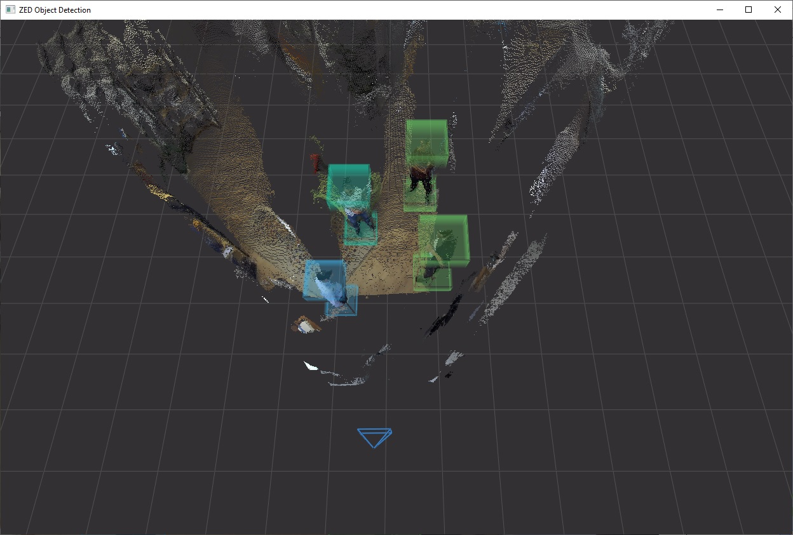

# ZED SDK - Object Detection

## This sample shows how to detect and track objects in space.

### Features
 - The camera point cloud is displayed in a 3D OpenGL view
 - 3D bounding boxes around detected objects are drawn
 - Objects classes and confidences can be changed

>*NOTE: A [ZED 2](https://store.stereolabs.com/products/zed-2) is required to use this module.*