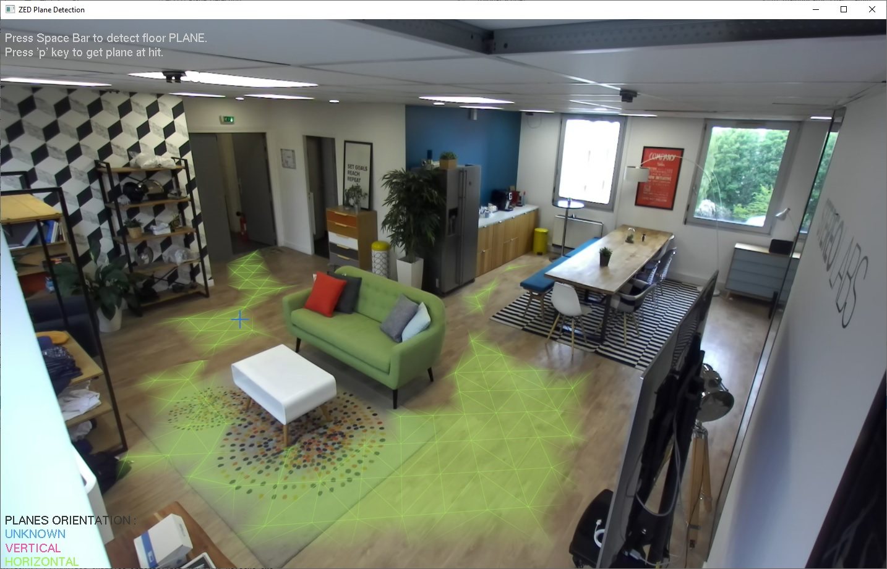

# ZED SDK - Plane Detection

## This sample shows how to retrieve surfaces data.

## Features
 - Live image is displayed in an OpenGL window
 - click on the image to estimate the plane of the pointed surface
 - press 'Spacebar' to estimate the floor plane

