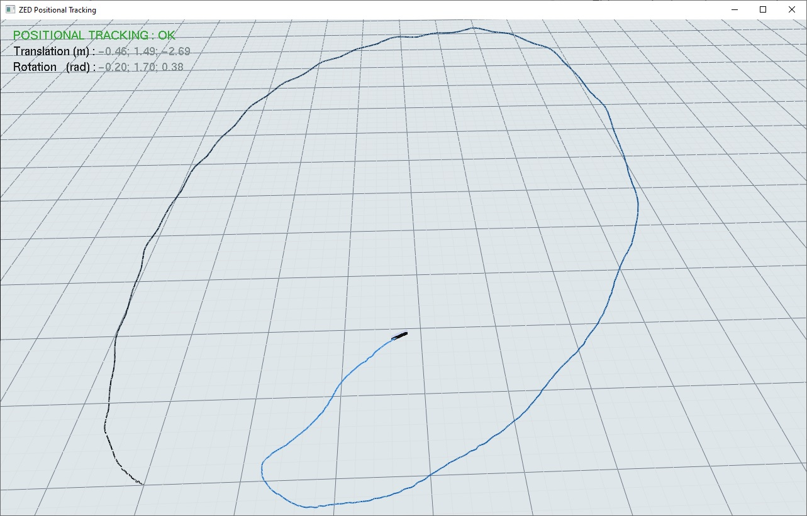

# ZED SDK - Positional Tracking

## This sample shows how to get the camera pose in a world reference

### Features
 - An OpenGL window displays the camera path in a 3D window
 - path data, translation and rotation, are displayed
 

### Global Localization

If you have GNSS sensor, you can fuse its data with your ZED positional tracking to improve outdoor positioning, to do so check ou [Global Localization sample](../../global%20localization/live/)