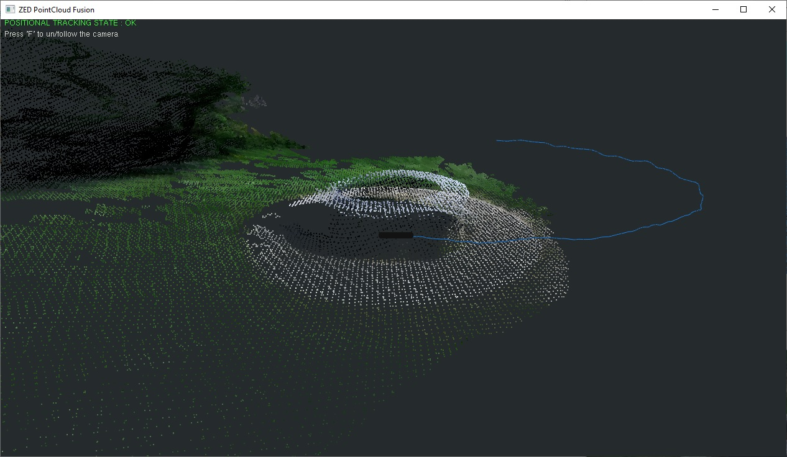

# ZED SDK - Point Cloud Fusion

## This sample shows how to map your environment as a Point cloud.

### Features
 - real time 3D display of the current fused point cloud
 - press 'f' to un/follow the camera movement

