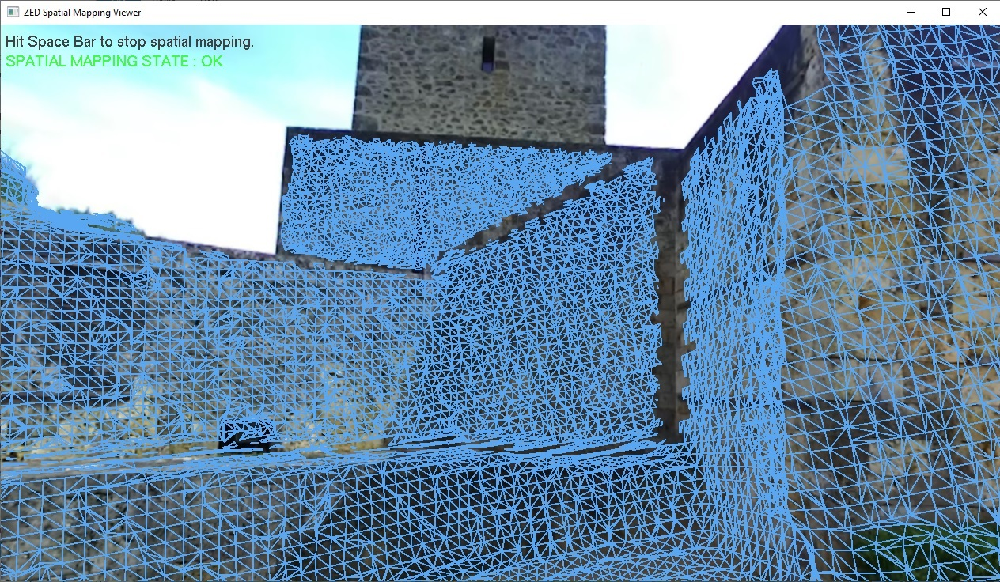

# ZED SDK - Spatial Mapping

## This sample shows how to map your environment.

### Features
 - Press 'Spacebar' to start/stop the mapping process
 - real time overlay of the mesh to the image
 - textures and post filters can be apply to the Mesh
 - final mesh is saved

